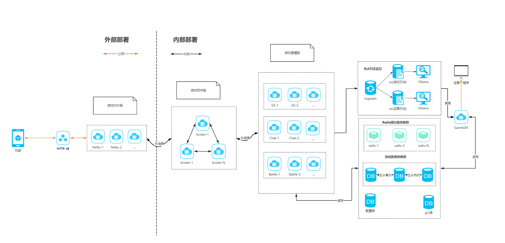

# 项目结构

```
.
├── L3Game-example
├── common                                          #后端服务
│   ├── common-core                                 # 业务框架
│   ├── common-game                                 # 业务通用工具类        
│   ├── common-kit                                  # 业务框架      
│   ├── common-micro-kit                            # 游戏部件 : 进一步减少开发实践过程中的工作量  
│   └── common-validation                           # 数据校验模块
├── example                                         #示例
│   ├── example-broker-server                       # 网关服务
│   ├── example-client                              # 模拟客户端访问        
│   ├── example-db                                  # 业务数据      
│   ├── example-jproto                              # 数据协议
│   ├── example-netty-server                        # netty服务  
│   └── example-server                              # 逻辑服务     
├── tools                                           # 工具类
│   ├── config                                      # sql文件
│   ├── createsql                                   # 生成多库多表sql工具
│   └── jprotobuf                                   # jprotobuf转换成proto文件
└── pom.xml                                         # 整体 maven 项目使用的 pom 文件
```

# 配置开发环境

### 后端

后端使用了 Java 语言的 Spring Boot 框架，并使用 Maven 作为项目管理工具。开发者需要先在开发环境中安装 JDK 17 及 Maven。

#### 编码风格与辅助
遵循[阿里巴巴Java开发手册规约在线文档](https://kangroo.gitee.io/ajcg/#/)

#### 架构


#### 配置server服务启动参数：
-DcommonLogPath=E:/logs/L3Game-example
-Dlogback.configurationFile=D:/liulongling/work/github/L3Game-example/config/logback.xml